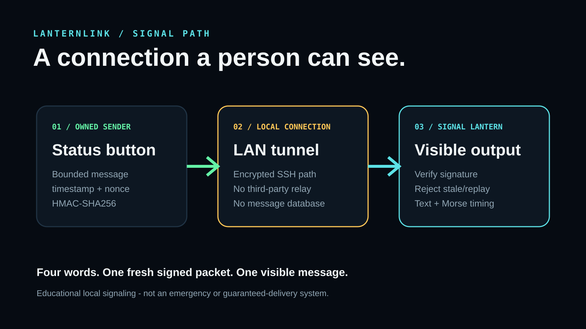
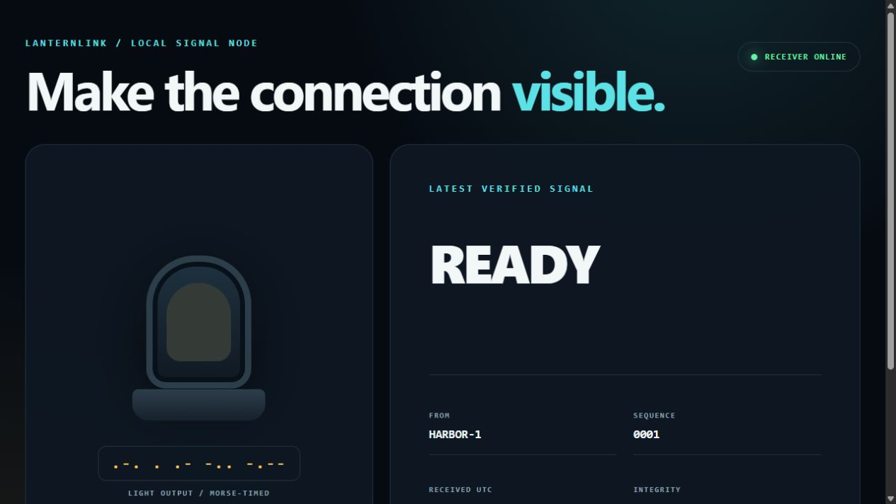

# LanternLink: A Signed Local Signal You Can Actually See



Most network messages disappear into notification trays, databases, or cloud
services. For **Make a Connection**, I wanted the connection itself to become
visible. LanternLink turns one small authenticated network packet into a text
status and a Morse-timed signal lantern, without a cloud account or message
history.

The result is a complete two-computer signaling system built with Python's
standard library. One owned computer sends one of four deliberately bounded
messages. A second owned computer verifies the packet and lights the browser
lantern. The documented test used `READY`, sent from the generic node label
`HARBOR-1`.

## What it sends

LanternLink accepts only four signals:

- `CHECK_IN` - request a status check;
- `READY` - the sender is ready;
- `ASSIST` - the sender requests attention;
- `ALL_CLEAR` - the condition has cleared.

I intentionally rejected free-form messages. That keeps the interface focused
and prevents an address, name, machine detail, or other private text from
slipping into a screenshot or log.

## The connection

The sender builds a small JSON packet containing a protocol version, generic
sender label, signal word, Unix timestamp, and random one-time nonce. It signs
the canonical packet with HMAC-SHA256. The receiver independently recomputes
the signature, checks that the timestamp is within 90 seconds, and rejects any
nonce it has already seen.

For the real two-device run, I kept the receiver on loopback and made a
temporary SSH reverse tunnel across my private LAN. That exposed the receiver
only as another loopback port on the sender. It demonstrated an actual
machine-to-machine connection without adding a firewall rule or advertising a
new service to the rest of the network. The HMAC check remains useful as a
second layer: only a process holding the shared secret can create an accepted
LanternLink packet.

```text
owned sender
  -> bounded word + timestamp + nonce + HMAC
  -> encrypted local SSH tunnel
  -> loopback receiver
  -> freshness / signature / replay checks
  -> browser text + Morse-timed lantern
```

## Building it

### 1. Make a deterministic packet format

Both ends must sign exactly the same bytes. LanternLink uses this canonical
form:

```text
LANTERNLINK/1|SENDER|MESSAGE|TIMESTAMP|NONCE
```

The sender and receiver share the same `canonical_payload()` and
`sign_payload()` functions. The secret comes only from an environment variable
and is never written to the project.

### 2. Bound every input

The sender label is limited to uppercase letters, numbers, and hyphens. The
message must be one of the four approved words. The nonce is a fixed-length
hex value. The HTTP request body is capped at 4 KiB. These limits make the
behavior understandable and the public evidence safe.

### 3. Reject stale and replayed packets

The receiver allows at most 90 seconds of clock skew. It also keeps a short,
in-memory cache of accepted nonces. Reusing a captured packet therefore fails
even while it is still fresh. The cache and latest signal disappear when the
receiver stops; there is no message database.

### 4. Turn the word into light

After validation, the browser renders the word and converts it to Morse timing.
Dots illuminate the beacon for one unit, dashes for three, and gaps separate
symbols. `READY` becomes:

```text
.-. . .- -.. -.--
```



The dashboard also shows the generic sender label, monotonic sequence number,
UTC receipt time, and the validation result. It never displays the shared
secret, network address, account name, or host name.

## Functional test

On 2026-08-09, the sender ran on an owned macOS computer and the receiver on a
separate owned Windows computer. Both devices used the same verified source
file. The sender issued `READY`; the receiver accepted sequence 1 as:

```text
SIGNED + FRESH + UNIQUE
```

The screenshot above comes from that live receiver state. The public evidence
record includes only the generic signal details. The temporary receiver and
tunnel were stopped after capture.

I also ran eight automated tests. They cover a valid HTTP delivery, bad
signature, stale timestamp, replayed nonce, strict sender and message fields,
the browser interface, Morse conversion, and the public privacy boundary. All
eight passed.

## What I learned

The interesting part was not moving a JSON object between computers. It was
making a small signal explain itself. A person can see what was received, when
it was received, and why it was accepted. A deliberately tiny vocabulary made
the project safer and clearer rather than less useful.

The next extension would be a physical LED or e-paper beacon driven by a
single-board computer. The protocol and validation code can already run on
ordinary Python-capable boards, but this entry only claims the two-computer
system that I actually tested.

## Source and materials

- source: `lanternlink.py` and `web/`;
- build and usage: `README.md`;
- bill of materials: `BOM.md`;
- original architecture diagram: `assets/architecture.svg`;
- test evidence: `EVIDENCE.md` and `artifacts/cross-device-evidence.json`;
- automated tests: `tests/test_lanternlink.py`.

LanternLink is educational and is not an emergency, life-safety, security, or
guaranteed-delivery system.
